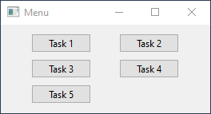
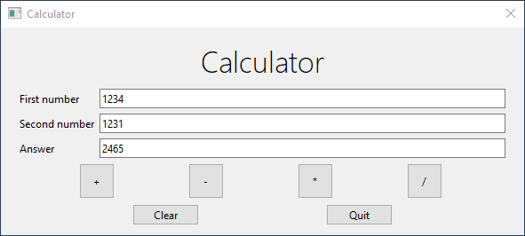
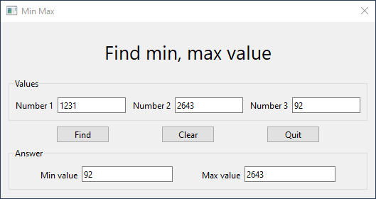
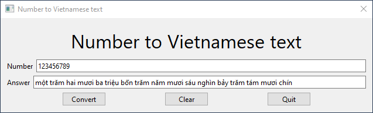
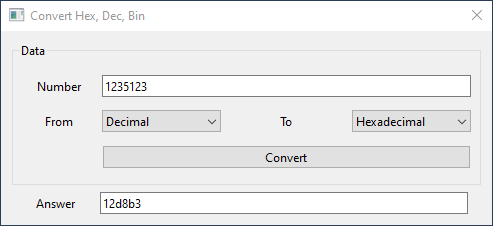
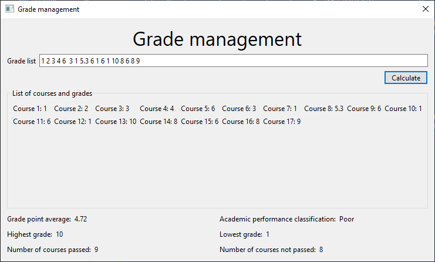

# Sơ lược

## Cấu trúc source code

Tổng quan folder source code như sau:

```bash
├── base_converter.py
├── calculator.py
├── grade_management.py
├── main.py
├── menu.py
├── min_max.py
├── number_to_vntext.py
├── ui
│   ├── base_converter.py
│   ├── base_converter.ui
│   ├── calculator.py
│   ├── calculator.ui
│   ├── grade_management.py
│   ├── grade_management.ui
│   ├── __init__.py
│   ├── menu.py
│   ├── menu.ui
│   ├── min_max.py
│   ├── min_max.ui
│   ├── number_to_vntext.py
│   └── number_to_vntext.ui
├── ui_files_watchdog.py
└── utils
    └── vn_number_converter.py
```

- File `main.py` là file chính của chương trình
- Folder `ui` chứa các files giao diện `.ui` được tạo ra từ Qt Designer và các files Python đã được biên dịch ra từ `.ui`
- Folder `utils` chứa các class hỗ trợ cho việc xử lí code logics.
- File `ui_files_watchdog.py` là chương trình giúp tự động biên dịch files `.ui` trong folder `ui` sang file `.py` khi có sự thay đổi.

Để chạy chương trình, dùng lệnh:

```bash
python main.py
```

Để chạy watchdog tự động compile file `.ui` sang `.py`, dùng lệnh sau:

```bash
python ui_files_watchdog.py
```

## Cấu trúc chương trình.

Ban đầu, chương trình import giao diện từ file `.py` trong folder `ui` và khai báo các biểu hiện cho chúng. Phần giao diện được đóng gói bằng class có dạng `Ui_*`.

```python
from ui.calculator import Ui_calculator
```

Một số hàm và chức năng chính:

- `setupUi()`: Cài đặt và hiện thị các đối tượng trên giao diện.
- `connect_signals_slots()`: Gán chức năng của các button vào các hàm tương ứng.
- `handle_*_clicked()`:  Xử lí hành vi khi đối tượng được click.
- `alert()`: Hiển thị cửa số cảnh báo.

# Menu

Đây là phần điều hướng chính của chương trình, 



```python
def connect_signals_slots(self):
	self.btn_task1.clicked.connect(lambda: self.openChild(Calculator))
	self.btn_task2.clicked.connect(lambda: self.openChild(Min_Max))
	self.btn_task3.clicked.connect(lambda: self.openChild(NumberToVNText))
	self.btn_task4.clicked.connect(lambda: self.openChild(BaseConverter))
	self.btn_task5.clicked.connect(lambda: self.openChild(GradeManagement))
```

Hàm này gán chức năng cho từng nút, mỗi nút khi được click sẽ gọi ra một cửa sổ với task tương ứng.

- Task 1: Calulator
- Task 2: Min Max
- Task 3: Number To Vietnamese Text
- Task 4: Base Converter
- Task 5: Grade Management

# Task 1. Calculator



Dưới đây là phần xử lí các button `+`, `-`, `*`, `/`

```python
def connect_signals_slots(self):nút
  self.btn_add.clicked.connect(lambda: self.handle_btn_operator_clicked("+"))
  self.btn_sub.clicked.connect(lambda: self.handle_btn_operator_clicked("-"))
  self.btn_mul.clicked.connect(lambda: self.handle_btn_operator_clicked("*"))
  self.btn_div.clicked.connect(lambda: self.handle_btn_operator_clicked("/"))
```

Khi nút được bấm vào thì hàm `handle_btn_operator_clicked()` với tham số là toán tử của nút đó sẽ được gọi.

```python
def handle_btn_operator_clicked(self, operator):
        try:
            ans = float(self.le_num1.text())
            num = float(self.le_num2.text())

            if operator == "+":
                ans += num
            elif operator == "-":
                ans -= num
            elif operator == "*":
                ans *= num
            else:
                ans = round(ans / num, 2)

            if operator != "/":
                if ans.is_integer():
                    ans = int(ans)
                else:
                    raise ValueError()

            self.le_ans.setText(str(ans))

        except ValueError:
            self.alert("Please enter valid integer!")
        except ZeroDivisionError:
            self.alert("Second number cannot be zero!")
```

Khi hàm được gọi, hai số đầu vào (ở đây là lineEdit - `le_num`, trong C# là textBox `tb_num`) sẽ được chuyển sang dạng số thực và sau đó sẽ thực hiện các phép `+`, `-`, `*`, `\` tương ứng. Sau đó nếu toán tử khác dấu `/` thì sẽ kết quả sẽ được chuyển về dạng số nguyên.

Tất cả được bọc trong khối `try except` để xử lí trường hợp dữ liệu đầu vào không hợp lệ và phép chia cho số 0.

# Task 2. Min Max



```python
def handle_btn_find_clicked(self):
  le_inputs = [self.le_num1, self.le_num2, self.le_num3]

  try:
      self.le_min.setText(self.transfrom(min, le_inputs))
      self.le_max.setText(self.transfrom(max, le_inputs))
  except:
      self.alert("Please enter valid number!")
      return
```

Khi nút find được click vào thì sẽ được xử lí như sau:

1. Tạo 1 danh sách chứa 3 số đầu vào
2. Dùng hàm `transform()` để tìm giá trị nhỏ nhất, giá trị lớn nhất của danh sách.

Hàm `transform()` như sau:

```python
def parse_number(self, line_edit):
		num = float(line_edit.text())
		return int(num) if num.is_integer() else numhiện

def transfrom(self, func, arr):
		return str(func(list(map(self.parse_number, arr))))
```

Hàm nhận vào tham số là `func` (hàm `min` hoặc `max`) và `arr` là danh sách đối tượng chứa 3 số đầu vào. Sau đó thực hiện:

1. Dùng hàm `map()` để chuyển đổi từ danh sách các đối tượng string thành số.
2. Dùng hàm `func()` đã được truyền vào để tìm giá trị nhỏ nhất, lớn nhất.

# Task 3. Number to Vietnamese Text



Đầu tiên chương trình import class `VNNumConverter` từ thư mục `utils` và tạo một đối tượng là `converter`, đối tượng này dùng để chuyển số sang chữ tiếng Việt.

```python
from utils.vn_number_converter import VNNumConverter
....
self.converter = VNNumConverter()
```

Sau đó gọi hàm `converter.number_to_vntext()` của đối tượng để chuyển đổi và ghi ra giao diện.

```python
def handle_btn_convert_clicked(self):
    try:
        num = int(self.le_input.text())
        self.le_ans.setText(" ".join(self.converter.number_to_vntext(num)).strip())
    except:
        self.alert("Please enter valid number!")
```

Về phần chuyển từ số sang tiếng Việt, ý tưởng là chia nhỏ số thành các cụm, mỗi cụm gồm 3 chữ số và xử lí từng cụm một. Với mỗi cụm, chuyển từng vị trí hàng trăm, hàng chục và hàng đơn vị qua chữ.

```python
def number_to_vntext(self, num):
    if num == 0:
        return self.ones(num)

    divisor = 10**9
    result = []
    i = 0
    while num != 0:
        if num // divisor != 0:
            count = self.get_length(num // divisor)
            if len(result) != 0:
                if count == 2:
                    result.append("không")
                    result.append("trăm")
                if count == 1:
                    result.append("không")
                    result.append("trăm")
                    result.append("linh")
            result += self.read_number(count, num // divisor)
            result.append(self.digits[i])
            num %= divisor
            divisor //= 1000
            i += 1
        else:
            i += 1
            divisor //= 1000

    if result[len(result) - 1] == ".":
        del result[len(result) - 1]
```

# Task 4. Base Converter



Khi bấm vào nút Convert thì hàm `handle_btn_convert_clicked()` sẽ được gọi. Hàm này gọi hai hàm khác là `convert_from()` là chuyển từ hệ cơ số ban đầu sang hệ 10. Sau đó nếu thành công thì sẽ gọi tiếp hàm `convert_to()`, chuyển số từ hệ 10 sang hệ đích.

```python
def handle_btn_convert_clicked(self):
	  if self.convert_from():
	      self.convert_to()
```

Hàm `convert_from()` sử dụng `int()` với tham số thứ hai để chuyển từ cơ số ban đầu sang cơ số 10. 

- `int(num, 2)`: chuyển từ binary sang decimal.
- `int(num, 16)`: chuyển từ hexadecimal sang decimal.

```python
def convert_from(self):
    try:
        base = self.cb_frombase.currentText()

        if base == "Decimal":
            self.num = int(self.le_input.text())
        elif base == "Binary":
            self.num = int(self.le_input.text(), 2)
        else:
            self.num = int(self.le_input.text(), 16)
    except:
        self.alert("Please enter valid number!")
        self.le_ans.clear()
        return False

    return True
```

Hàm `convert_to()` sẽ chuyển số từ hệ 10 sang hệ nhị phân và thập lục phân bằng hàm `bin()` và `hex()` tương ứng.

```python
def convert_to(self):
    base = self.cb_tobase.currentText()

    if base == "Decimal":
        ans = str(self.num)
    elif base == "Binary":
        ans = bin(self.num)[2:]
    else:
        ans = hex(self.num)[2:]

    self.le_ans.setText(ans)
```

# Task 5. Grade Management



Sau khi bấm Calculate thì hàm sau sẽ được gọi.

```python
def handle_btn_calculate_clicked(self):
    if not self.parse_grade_list():
        return

    self.clear_gb()
    self.write_to_gb()
    self.calculate_properties()
```

Hàm này thực hiện 4 thao tác chính:

1. Thực hiện chuyển danh sách đầu vào thành kiểu `list` và kiểm tra dữ liệu đầu vào có hợp lệ hay không bằng hàm `parse_grade_list()`.
2. Xóa danh sách các môn đã được hiển thị trên màn hình bằng hàm `clear_gb()`
3. Thực hiện in các điểm ra màn hình bằng hàm `write_to_gb()`
4. Tính các thuộc tính như điểm trung bình, điểm cao nhất,.. bằng hàm `calculate_properties()`

Trong hàm `calculate_properties()`, các thuộc tính có thể dễ dàng tính được bằng cách sử dụng các hàm như `min()`, `max()`, `sum()` và `len()`. Riêng phần xếp loại học lực thì cần thêm hàm `get_performance_classify()` để xếp loại.

```python
def get_performance_classify(self):
    gpa = float(self.lbl_gpa.text())

    if gpa >= 8 and all(i >= 6.5 for i in self.gl):
        return "Excellent"
    elif gpa >= 6.5 and all(i >= 5 for i in self.gl):
        return "Good"
    elif gpa >= 5 and all(i >= 3.5 for i in self.gl):
        return "Average"
    elif gpa >= 3.5 and all(i >= 2 for i in self.gl):
        return "Below Average"
    else:
        return "Poor"
```

Đầu tiên điểm trung bình được gán vào biến `gpa` sau đó dùng các câu lệnh `if` `else` để xử lí. Hàm `all()` ở đây được xử dụng để đảm bảo tất cả các phần tử của danh sách đều đúng.

```python
all(i >= 6.5 for i in self.gl)
```

Hàm trên sẽ trả về `True` nếu tất cả các phần tử của mảng `gl` đều có giá trị lớn hơn hoặc bằng 6.5
