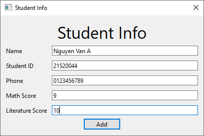
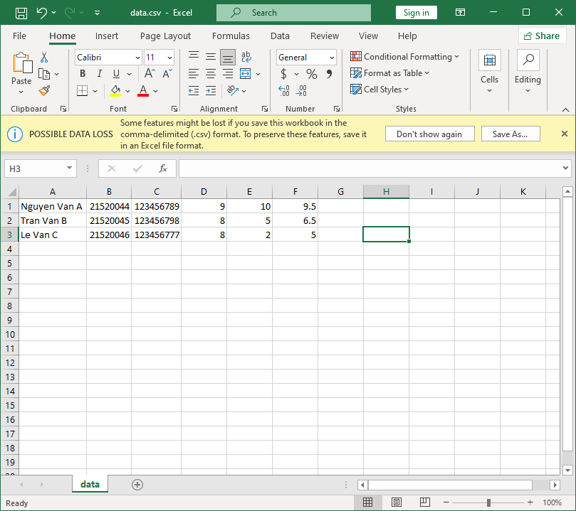

# Sơ lược source code

## Cấu trúc

Project được viết bằng PyQt6.

```bash
src/
├── main.py
├── menu.py
├── tasks
│   ├── task1
│   │   ├── task1.py
│   │   └── ui
│   │       ├── task1.py
│   │       └── task1.ui
│   ├── task2
│   │   ├── task2.py
│   │   └── ui
│   │       ├── task2.py
│   │       └── task2.ui
│   ├── task3
│   │   ├── task3.py
│   │   └── ui
│   │       ├── task3.py
│   │       └── task3.ui
│   ├── task4
│   │   ├── task4.py
│   │   └── ui
│   │       ├── student_info.py
│   │       ├── student_info.ui
│   │       ├── task4.py
│   │       └── task4.ui
│   └── task5
│       ├── task5.py
│       └── ui
│           ├── task5.py
│           └── task5.ui
├── ui
│   ├── menu.py
│   └── menu.ui
├── ui_files_watchdog.py
└── utils
    └── alert.py
```

- `main.py` là file chính của project.
- `menu.py` là file xử lí menu.
- thư mục `tasks` gồm nhiều thư mục con, chứa code của từng bài tập nhỏ.
- thư mục `ui` chứa file giao diện.
- thư mục `utils` chứa các hàm tiện ích dùng chung.
- `ui_files_watchdog.py` là file dùng để tự động biên dịch `.ui` sang `.py` mỗi khi có sự thay đổi.

## Chạy project

```bash
$ python main.py
```

# Cấu trúc chương trình

File `main.py` sẽ gọi `menu.py`, một cửa sổ sẽ hiện lên và có 5 nút chọn tương ứng với 5 bài tập tương ứng.
## menu.py


Ban đầu từng task sẽ được import.

```python
from tasks.task1.task1 import Task1
from tasks.task2.task2 import Task2
...
```

Sau đó hàm sau sẽ được gọi để gán từng task vừa import vào với nút button tương ứng. Khi button tương ứng được click vào thì task tương ứng sẽ được gọi thông qua hàm `openChild()`

```python
def connect_signals_slots(self):
		self.btn_task1.clicked.connect(lambda: self.openChild(Task1))
		self.btn_task2.clicked.connect(lambda: self.openChild(Task2))
...
```

Hàm `openChild()` ẩn menu đi và hiển thị task được gọi, sau khi task hoàn thành xong hoặc bị tắt thì menu sẽ được hiển thị lại.

```python
def openChild(self, childClass):
    self.hide()
    childClass(self).exec()
    self.show()
```

## task1.py


Chức năng chính của từng button:

### To Upper & To Lower

```python
def handle_btn_to_upper_clicked(self):
		self.te_content.setText(self.te_content.toPlainText().upper())
```

Lấy nội dung từ textEdit (`te_content`) và dùng method `.upper()` trong python để chuyển toàn bộ nội dung sang chữ in hoa, tương tự ta có `.lower()` để chuyển sang chữ thường.

### Read & Write

```python
def handle_btn_read_clicked(self):
    file_name, _ = QFileDialog.getOpenFileName(self, filter="Text Files (*.txt)")
    if file_name:
        with open(file_name, "r") as f:
            self.te_content.setText(f.read())
```

Dùng method `getOpenFileName` trong class `QFileDialog` để mở cửa cửa sổ chọn file.


Nếu có file được chọn thì sẽ được mở lên và sao chép nội dung vào `te_content` để hiển thị lên màn hình.

Tương tự với button Write thì nội dung sẽ được lấy từ `te_content` và ghi vào file.

## task2.py


Tương tự như `task1.py` thì khi click vào button Read File, một cửa sổ chọn file sẽ hiện lên và nội dung sẽ được đọc vào `te_content`.

Name và URL sẽ được lấy ra từ `file_name` của file vừa được chọn, còn các trường bên dưới sẽ được tính như sau:

- Line counts = số kí tự xuống dòng `\n`, nếu file khác rỗng và kí tự cuối cùng của file khác `\n` thì +1 (ví dụ như 1 dòng và không có xuống dòng `\n` thì vẫn được tính là 1)
    
    ```python
    if len(contents) and contents[-1] != "\n":
        n = 1
    else:
        n = 0
    self.le_line.setText(str(contents.count("\n") + n))
    ```
    
- Word counts được tính bằng số phần tử trả về của method `split()` (hàm này tách chuỗi dựa trên khoảng trắng)
- Char counts = độ dài của nội dung

## task3.py


Chúng ta sẽ tập trung vào chức năng của button Calculate.

```python
def handle_btn_cal_clicked(self):
    contents = ""
    for line in self.te_input.toPlainText().splitlines():
        line = line.strip()
        try:
            if self.check_valid_expression(line):
                ans = str(eval(line))
            else:
                raise Exception
        except:
            ans = "Invalid expression!"
        contents += f"{line} = {ans}\n"
    self.te_output.setText(contents)
```

Sau khi đọc dữ liệu từ file vào (button Read), từng dòng một sẽ được xử lí. Với mỗi dòng, chỉ những kí tự tính toán cơ bản `+` `-` `*` `\` `%`, chữ số, và khoảng trắng được chấp nhận. Việc kiểm tra này được kiểm tra bằng Regex:

```python
def check_valid_expression(self, expr):
    return re.match("^[\\d+\\-*\\/%\\s]+$", expr)
```

Nếu biểu thức hợp lệ thì dòng đó sẽ được đưa vào hàm `eval()` để tính toán kết quả và đưa ra màn hình. `eval()` là một hàm có chức năng thực hiện mọi câu lệnh được đưa vào dưới dạng string.

Nếu biểu thức không hợp lệ thì kết quả sẽ thông báo là “Invalid expression!”

## task4.py

Sau click vào button Add thì một cửa sổ mới dùng để nhập dữ liệu sẽ được hiện lên, sau khi nhập xong thì một list sẽ được trả về gồm các dữ liệu vừa nhập. Lúc này điểm trung bình (GPA) chưa được tính.

```python
def student_info(self):
    return [
        self.le_name.text(),
        self.le_id.text(),
        self.le_phone.text(),
        self.le_math.text(),
        self.le_lit.text(),
    ]
```




Tiếp theo đó, dữ liệu vừa nhận được sẽ được lưu vào `db` và được hiển thị ra cửa sổ bằng hàm `add_items_to_table()` và ghi ra file `input.txt` bằng hàm `write_csv()`. Hàm đọc và ghi file sử dụng định dang `.csv` Excel có thể đọc được và thuận tiện khi thao tác.

```python
def handle_btn_add_clicked(self):
        dialog = StudentInfo(self)
        if dialog.exec():
            self.db.append(dialog.student_info)
            self.add_items_to_table([dialog.student_info])
            self.write_csv("input.txt", self.db, ";")
```


Sau khi bấm vào button Export to Excel file, dữ liệu sẽ được đọc từ file `input.txt` và GPA sẽ được tính bằng hàm `get_gpa()` với 2 tham số đầu vào ở đây là điểm toán và điểm văn. Sau khi tính xong thi hàng dữ liệu hiện tại cùng GPA vừa tính sẽ được đưa vào `db` và hiển thị ra màn hình.

```python
data = self.read_csv("input.txt", ";")
for row in data:
    if row:
        row.append(self.get_gpa(row[-2], row[-1]))
        self.db.append(row)

self.tb_info.setRowCount(0)
self.add_items_to_table(self.db, True)
```

Sau đó một cửa sổ sẽ hiện lên để chọn file lưu dưới dạng `.csv` với dữ liệu được lấy từ `db`. 

```python
file_name, _ = QFileDialog.getSaveFileName(self, filter="Excel (*.csv)")
if file_name:
    self.write_csv(file_name, self.db)
```


File được lưu có thể được mở bình thường bằng Excel.



Button Load from Excel file cũng tương tự như trên nhưng thực hiện nhiệm vụ đọc file `.csv` và hiển thị lên giao diện.

## task5.py


Chức năng của các hàm, thuộc tính chính như sau:

- `init_file_system_tree_view()`: Khởi tạo model `tv_main` giúp hiển thị các files và folders
    - Ở đây sử dụng `QFileSystemModel` để lấy thông tin về hệ thống file và dùng `QTreeView` để hiện thị chúng.
- `update_tree_view(path)`: Cập nhật `current_path` với giá trị `path` được đưa vào và hiển thị nội dung của folder `current_path`.
- `handle_tv_main_doubleClicked()`: Khi double click vào folder thì giao diện sẽ hiển thị nội dung của folder đó.

Khi click vào button Browse thì một cửa sổ mới sẽ hiện ra dùng để chọn folder mình muốn, nếu có thư mục được chọn thì sẽ hiển thị lên giao diện.

```python
def handle_btn_browse_clicked(self):
    path = QFileDialog.getExistingDirectory(
        self, options=QFileDialog.Option.ShowDirsOnly
    )
    if path:
        self.update_tree_view(path)
```

hàm `getExistingDirectory()` dùng để chọn folder đã có sẵn và thêm tùy chọn `ShowDirsOnly` để hiện folder thay vì cả file và folder.
