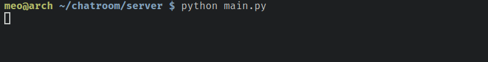

# Cấu trúc

Project được viết bằng PyQt6.

```bash
chatroom
├── client
│   ├── login_register.py
│   ├── main.py
│   ├── sock.py
│   ├── ui
│   │   ├── login_register.py
│   │   ├── login_register.ui
│   │   ├── main.py
│   │   └── main.ui
│   └── ui_files_watchdog.py
└── server
    ├── main.py
    ├── model
    │   ├── chatroom_database.py
    │   └── user_database.py
    └── routes.py
```

- Gồm 2 phần chính là Client và server.
- `main.py` là file chính của mỗi project.
- Thư mục `ui` chứa file giao diện.
- `ui_files_watchdog.py` là file dùng để tự động biên dịch `.ui` sang `.py` mỗi khi có sự thay đổi.

## Client

- `login_register.py` chứa code liên quan đến các chức năng khi chọn vào Login / Register ở trong Chat room.
- `sock.py` một lớp dùng để kết nối đến server.

## Server

- Thư mục `model` chứ các model database dùng để quản lí các phòng và người dùng.
- `routes.py` là chứa các endpoint xử lí mỗi hành động tương ứng được gửi đến từ client.

## Các enpoint chính

- `register`: Đăng kí người dùng mới
- `login`: Đăng nhập và trả về `session_id`
- `logout`: Đăng xuất
- `new_room`: Tạo 1 room mới và trả về `room_id`
- `join_room`: Tham gia vào `room_id` được gửi kèm
- `out_room`: Thoát khỏi room hiện tại
- `send_msg`: Gửi tin nhắn

## Chạy Client / Server

Di chuyển vào thư mục tương ứng và chạy lệnh:

```bash
$ python main.py
```

# Demo chương trình

## Server

Khởi tạo server:



## Client

Chạy client:


### Alice

Vào phần Chat room sau đó chọn Login / Register và đăng kí user tên là alice.


Tiếp đó bấm chọn login và màn hình hiện ra dòng chữ Welcome alice.


Tiếp đến vào phần Chat room và chọn New room, một Room ID mới được sinh ra và thêm alice vào đó.


### Bob

Khởi tạo một client mới và đăng kí với user là bob.


Nhập Room ID của Alice vào rồi chọn Join room, ngay lập tức bob được thêm vào chat room của Alice và Alice được thông báo về sự hiện diện của Bob.


Alice và Bob chat với nhau:


Khi Alice thoát thì Bob nhận được thông báo.


Client và server log:


