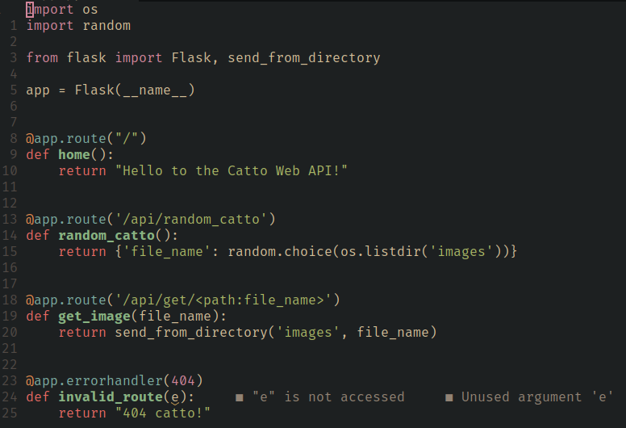

# Tổng quan source code

```bash
├── main.py
├── menu.py
├── tasks
│   ├── task1
│   │   ├── __init__.py
│   │   └── ui
│   │       ├── task1.py
│   │       └── task1.ui
│   ├── task2
│   │   ├── __init__.py
│   │   └── ui
│   │       ├── task2.py
│   │       └── task2.ui
│   ├── task3
│   │   ├── __init__.py
│   │   └── ui
│   │       ├── task3.py
│   │       └── task3.ui
│   └── task4
│       ├── __init__.py
│       └── ui
│           ├── task4.py
│           ├── task4.ui
│           ├── view_source.py
│           └── view_source.ui
├── ui
│   ├── menu.py
│   └── menu.ui
├── ui_files_watchdog.py
└── web_server
    ├── app.py
    ├── config.py
    ├── images
    │   ├── blanket_cat.jpg
    │   ├── cat_drinking_milk.jpg
    │   ├── cat_holding_a_milk_bag.jpg
    │   ├── cat_lying_on_the_ice_cream_cabinet.jpg
    │   ├── no_signal_cat.jpg
    │   ├── police_cat.jpg
    │   └── sleeping_cat_with_teddy_bear.jpg
    └── run_server.sh

13 directories, 29 files
```

- `[main.py](http://main.py)` là file chính của source code, để chạy ta dùng lệnh:

```bash
python main.py
```

- Folder `tasks` chứa code của từng task trong bài
- Folder `ui` chứa giao diện
- Folder `web_server` chứa Web Server cho Task 1 và Task 3.
- `ui_files_watchdog.py` để tự động compile file giao diện sang python mỗi khi có sự thay đổi.

# Web Server

Ở đây sử dụng Flask để tạo 1 Web đơn giản có chức năng chính là hiển thị ảnh một cách ngẫu nhiên trong folder `images`.



Ta dùng thêm Gunicorn để chỉnh sửa header `Server` trả về mỗi khi có request đến.


Để chạy server, ta dùng file `run_server.sh`.


# Task 1

Ở đây ta dùng module `requests` để giao tiếp với server. Sau ghi lấy nội dung về ta sẽ có nội dung source ở trong `r.text` và headers ở trong `r.headers`. Tiếp đến ta gán nội dung của source vào Textbox và thêm từng trường trong headers vào bảng.


Kết quả với web trường:


Kết quả với server tự tạo. `Server` header đã được thay đổi bằng giá trị khác.


# Task 2

Task này sử dụng `QWebEngineView` để hiển thị trang web. Ở chức năng View Source ta dùng scheme `view-source:`. Nếu url đang sử dụng bắt đầu với `view-source:` thì ta sẽ xóa đi, ngược lại nếu không có thì ta sẽ thêm vào rồi sau đó load lại trang.


Còn về User Agent ta sẽ lưu sẵn vào dict và sau đó dùng hàm `setHttpUserAgent()` để thay đổi dựa trên lựa chọn trong Combobox.


Demo:


Bấm vào View Source, để xem source và bấm thêm 1 lần nữa để trở về


Bấm vào Combobox và chọn User Agent thích hợp sau đó gõ enter vào thanh địa chỉ để tải lại trang để đổi User Agent.


# Task 3

Trước hết ta cần chạy server bằng cách di chuyển vào thư mục `web_server` và chay:

```bash
./run_server
```

Ở đây ta sẽ tương tác với web server ở trên, route `/api/random_catto` sẽ trả về ngẫu nhiên tên file.


Để xem ảnh ta dùng route `/api/get/<file_name>`


Ở đây ta sẽ dùng module `requests` để tương tác với server. Đầu tiên là lấy file name về, sau đó ta request lại 1 lần nữa đến api get để lấy ảnh ở dạng bytes.

Ta sẽ hiển thị ảnh bằng cách dùng 1 label gán bằng đối tượng `QPixmap` để hiển thị ảnh dạng bytes.


Đây là kết quả khi bấm vào nút Get.


# Task 4

Ở đây sử dụng `QWebEngineView` để duyệt web và hiển thị HTML.

Khi gõ địa chỉ rồi ấn Enter thì địa chỉ sẽ được kiểm tra, nếu là một địa chỉ hợp lệ thì sẽ đi đến đó còn nếu không thì sẽ tìm kiếm với Google.


Về View Source, ở đây sử dụng module `requests` để lấy dữ liệu về, từ đó hiển thị lên cửa sổ. HTML sẽ ở trong `r.content`, headers sẽ nằm ở `r.request.headers` và `r.headers`.


Tiếp đến là Save Page, đầu tiên một cửa số sẽ được mở ra để chọn đường dẫn lưu file HTML. Kế tiếp, ta dùng `BeautifulSoup` để parse HTML và tìm các tag như `img`, `src`, … với mỗi tag đó ta sẽ tìm link bên trong và tải về máy.

Với mỗi link tìm thấy, sau khi tại xong ta sửa lai link trong HTML trỏ về thư mục tải về để có thể mở offline.


## Demo

Khi mở lên trình duyệt sẽ mở google.


Ta có thể gõ bất kì vào thanh địa chỉ để tìm kiếm, ví dụ ở đây là `flowers`


Khi bấm vào View Souce thì một cửa sổ sẽ hiện ra, bên trái là source còn bên phải là Headers gửi đi và nhận về được chia làm 2 tab.


Khi bấm vào Save Page thì 1 cửa sổ sẽ hiện ra để lưu file


Log khi dowload:


