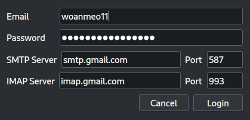

# Gửi và nhận Email

**TODO/Note**: `async` không làm process chạy song song, cần dùng `multithread`

Để chạy ta cài thư viện PyQt6 và chạy file `main.py`.

```bash
pip install PyQt6
python main.py
```

Khi chạy client, một cửa sổ đăng nhập sẽ hiện lên.



Khi click login thì chương trình sẽ dùng Email và Password cùng với thông tin Server, Port được nhập để login vào 2 server SMTP và IMAP.


Ở đây thử với mail server gmail nên mật khẩu sẽ là app password của tài khoản tương ứng.

## Đọc email

Sau khi đăng nhập vào thì ta bấm vào nút Reload, danh sách các mail trong hộp thư chính (INBOX) sẽ được load, ta có thể click chuột vào, một cửa sổ sẽ hiển thị ra với nội dung của mail.

Khi nút Reload được click vào thì đầu tiên là giá trị của Total và Recent sẽ được cập nhật dựa trên số lượng tất cả các mail và số lượng mail chưa đọc. Chỉ số của các mail chưa được đọc sẽ được đưa vào danh sách `unseen`.


Tiếp đến là duyệt từng mail và dùng `BODY.PEEK` để xem nội dung mà không bị đánh dấu là đã đọc. Với mỗi mail, ta lấy nội dung của `Subject`, `From` và `Date` để hiện thị lên bảng. Nội dung của mail ta sẽ lưu vào một danh sách để lúc sau lấy ra hiện thị lên cửa sổ khi click vào từng mục trong bảng.


Khi bấm vào từng mail trong bảng thì một cửa số sẽ được hiện thị với nội dung của mail đó. Nội dung này được lấy ra từ trong danh sách đã lưu trước đó. Cuối cùng, mail sẽ được đánh dấu là đã đọc và gửi về server..


Hàm đánh dấu này dùng `async` để tránh làm đứng process. Sau khi gửi flag `Seen` về server, giá trị của Recent sẽ trừ đi 1 và xóa chỉ số của mail hiện tại khỏi danh sách `unseen`.


## Gửi email

Phần gửi email ở tab kế bên Mailbox, ta điền người gửi và địa chỉ kèm theo đó là nội dung và bấm nút gửi. Ta kiểm tra kết quả trên Gmail.


Khi bấm nút Send thì các trường như `From`, `To`, `Subject` và `Body` sẽ được lấy ra từ thông tin ta nhập vào và gửi lên server theo chuẩn RFC. Riêng trường `From` được lấy từ email khi ta login.


